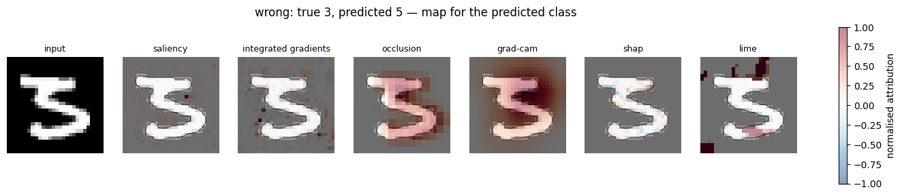
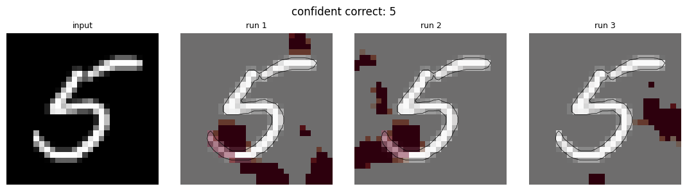
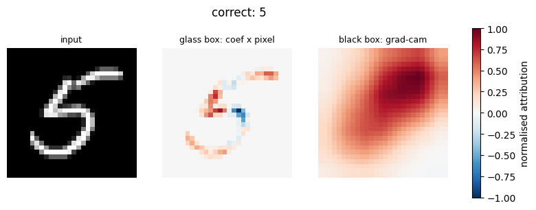

# Can You Trust a Saliency Map?

Six XAI techniques applied to the same classifier on the same images, and a
number attached to each one: how much of its attribution actually lands on the
digit rather than on the background.

That number changed two decisions and exposed two bugs that the figures hid.

## The problem with reading heatmaps

A saliency map is a coloured picture, and a coloured picture always suggests a
story. Look at six of them side by side and you will find structure in all six,
because the eye supplies it.

This notebook scores every map instead: mean absolute attribution inside the
stroke against outside it, on the same threshold used to draw the contour.

| technique | inside | outside | ratio |
|---|---|---|---|
| SHAP | 0.223 | 0.007 | **31.8** |
| Occlusion | 0.682 | 0.124 | **5.5** |
| Grad-CAM | 0.854 | 0.482 | 1.8 |
| Integrated Gradients | 0.076 | 0.099 | 0.8 |
| Saliency | 0.031 | 0.093 | 0.3 |
| LIME | 0.002 | 0.103 | 0.0 |

## What the number caught

**A baseline that was not what its comment said.** Occlusion covers patches of
the image with a baseline value, and zero is the obvious choice — except that
after ImageNet normalisation zero is mid-grey, not black. On MNIST, where the
background is black, occluding the background was a large change to the input,
so the maps lit up the background instead of the digit. Fixing the baseline moved
the ratio from below 1 to 5.5.

**A layer chosen on intuition.** Grad-CAM reads a convolutional layer, and a
finer layer seems the better choice. Scored across twenty images, the opposite
holds: the deepest block lands more attribution on the stroke than the finer ones.

| layer | map size | ratio |
|---|---|---|
| denseblock2 | 28x28 | 1.2 |
| denseblock3 | 14x14 | 1.4 |
| denseblock4 | 7x7 | **1.7** |

Neither was visible in the figures. Both changed the conclusions.

## Where the maps stop working

Occlusion is the only one that gives a region-level reading, and the only one
whose map moves when you ask for the true class instead of the predicted one.

Grad-CAM returns a single blob: at 7x7, each cell covers roughly 4x4 pixels of a
28x28 digit, so it cannot resolve the top stroke from the belly — the very
distinction the 3/5 confusion turns on. Its ratio of 1.8 says the blob sits where
the digit is, which on centred MNIST digits is nearly free.

SHAP is the most concentrated of all but marks scattered pixels rather than
regions. LIME's superpixel segmentation is built for natural photographs and has
almost nothing to segment on a digit against a uniform background.

## A negative result, reported

The 3/5 confusion looked like it came from the ambiguous upper stroke: on single
cases, the occlusion map shifts when the target changes. Aggregated over all 22
errors, the ratio does not separate the groups at all — 1.8 for correct
predictions, 1.9 for wrong ones. The single-case reading stays a hypothesis this
notebook does not confirm.

## Instability as a diagnostic

LIME is the only one of the six with a random component. Three runs on a
confident prediction share a core; three runs on a misclassified one agree on
nothing. The explainer is not failing — it is reporting that the model has no
decisive region on that image.

## The glass box as the bar

A logistic regression on the raw pixels reaches 91.89%. The fine-tuned DenseNet121
reaches 97.79%. Those 5.9 points are what justifies giving up transparency, and
the cost is visible: ten global coefficient maps, additive and summing back to the
prediction, replaced by six local techniques of which one gives a region-level
reading.

## Reproducibility

Everything is seeded, including cuDNN's convolution algorithms and GradientShap's
internal resampling. This was not incidental: the first version of the notebook
produced maps of opposite sign for the same image and the same target in two
different sections, which is how the problem surfaced.

## What is missing

The debugging loop stops at diagnosis. The next step is occlusion-based
augmentation — the XAI technique turned into a training technique — retraining,
and measuring whether the 3/5 confusions drop.
